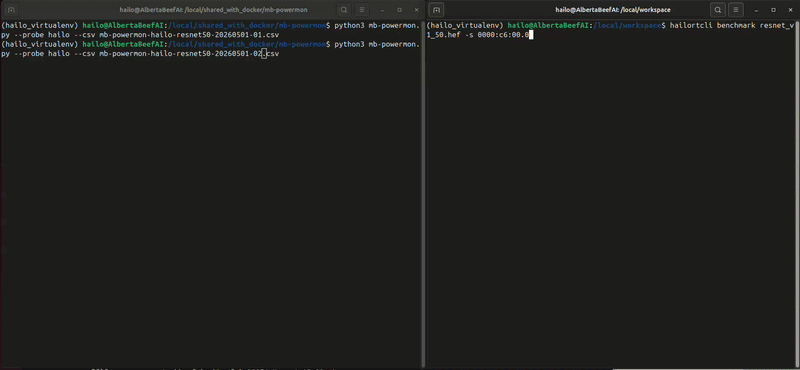

# mb-powermon

Power and temperature measurement utility for edge AI NPUs.



`mb-powermon` is an [NVTOP](https://github.com/Syllo/nvtop)-style terminal monitor for AI accelerator boards and external power-measurement hardware. It runs anywhere a terminal does — no X server, no GUI — and shows per-device identity, PCIe link state, temperatures, and power as scrolling time-series graphs.

## Supported devices

| Probe       | Hardware                                                                 | Metrics                                              |
| ----------- | ------------------------------------------------------------------------ | ---------------------------------------------------- |
| `hailo`     | Hailo-8 / 8L / 8R PCIe + M.2 modules                                     | `POW`, `TS0`, `TS1` (both on-die temperature sensors) |
| `axelera`   | Axelera Metis M.2                                                        | `TEMP` (per-core max via `triton_trace`); power not exposed |
| `elmorlabs` | ElmorLabs PMD2 (USB CDC, VID:PID `0483:5740`)                            | `PCIE1/2/3`, `TOTAL`; 10 rails dumped in `--once`    |
| `adafruit`  | Up to 4× Adafruit INA228 power monitors on an Adafruit FT232H USB→I²C bridge (`0403:6014`) | One `P<n>` trace per detected sensor; auto-classifies rail voltage (`P1` → `P1(3.3V)`) |

Each panel also displays the device's PCIe link width/speed and ASPM state when applicable.

## Usage

```bash
# Live TUI — q/ESC quit, r reset history, h help
python3 mb-powermon.py

# Single-shot text snapshot
python3 mb-powermon.py --once

# Stream CSV alongside the TUI (line-buffered, safe to `tail -f`)
python3 mb-powermon.py --csv run.csv

# Restrict to specific probes; the order also controls panel order
python3 mb-powermon.py --probe adafruit,hailo

# Limit to a specific device by PCI BDF or serial port path
python3 mb-powermon.py --device 0000:c6:00.0

# Tune INA228 calibration (shared across all sensors on the bus)
python3 mb-powermon.py --ina228-shunt 0.015 --ina228-max-current 5

# Print probe-init diagnostics to stderr
python3 mb-powermon.py --verbose
```

`--help` lists every option, including `--interval`, `--time-range`, `--temp-max`, `--power-max`, `--graph-rows`, `--active-only`, and the `--ina228-*` calibration knobs.

## Installation

`mb-powermon` is a single Python 3 script. Vendor SDKs are loaded lazily — install only what you need for the hardware you have.

| Probe       | Requires                                                                 |
| ----------- | ------------------------------------------------------------------------ |
| `hailo`     | [`hailo_platform`](https://hailo.ai/) (HailoRT runtime + Python bindings) |
| `axelera`   | `axelera.runtime` Python package + the `triton_trace` binary (auto-located on `$PATH` or `/opt/axelera/runtime-*/bin`) |
| `elmorlabs` | `pyserial`                                                               |
| `adafruit`  | `adafruit-blinka`, `adafruit-circuitpython-ina228`, `pyftdi`             |

If a probe's SDK isn't installed, devices of that type render with an `ERROR` row but the rest of the TUI keeps working.

### ASPM readings

Reading the PCI Express Capability's Link Control register (for the ASPM field) requires access past byte 64 of `/sys/bus/pci/devices/<BDF>/config`. Run as root, or configure passwordless `sudo` so the tool can escalate via `sudo -n cat`. Otherwise the field shows `<needs root or sudo -n>`.

### FT232H + INA228

The Adafruit probe sets `BLINKA_FT232H=1` so Blinka uses the FT232H USB→I²C backend. By default it scans the four canonical INA228 addresses `{0x40, 0x41, 0x44, 0x45}` and instantiates one sensor per responding address. Override with `--ina228-addresses`.

## Output

Each device renders as a panel with:

1. **Identity line** — `Device N [BDF Board ARCH]  PCIe x4/x4 @ 8.0GT/s  ASPM L1`
2. **Stats line** — product name, description, part number, serial (or `ERROR` + reason)
3. **Inline bars** — one per metric, color-coded
4. **Time-series graph** — one trace per metric; y-axis caps from `--temp-max` / `--power-max` or per-metric overrides

The `--csv` and `--once` outputs include the full per-rail PMD2 snapshot and per-sensor INA228 voltage/current, which the TUI omits to keep panels readable.

## Plotting CSV runs

`csv-to-html-plot.py` turns an mb-powermon CSV into a self-contained HTML file with two [Chart.js](https://www.chartjs.org/) plots — power and temperature, one trace per `<device>_POW / _TEMP / _TS0 / _TS1` column. The output works offline (Chart.js loads from a CDN; cache the page once and it renders without network access).

```bash
# Default: writes <input>.html next to the CSV
python3 csv-to-html-plot.py -i run.csv

# Overlay hailortcli benchmark avg/max markers from a captured log
python3 csv-to-html-plot.py -i run.csv -l benchmark.log -o run.html

# Disable auto downsampling (1 = every sample plotted)
python3 csv-to-html-plot.py -i run.csv -d 1
```

For long captures the script applies min-max bucket downsampling (preserving peaks and troughs) so the HTML stays a manageable size while still showing transients. With `-l`, it parses `Device <BDF>: Power in streaming mode (average/max)` blocks from a `hailortcli benchmark` log and overlays each as a horizontal marker on the matching device's active phase.

## Acknowledgements

Inspired by [NVTOP](https://github.com/Syllo/nvtop). 
PMD2 support from [ElmorLabs/PMD2-Python](https://github.com/ElmorLabs/PMD2-Python).

## License

Apache License 2.0. See [LICENSE](LICENSE).
