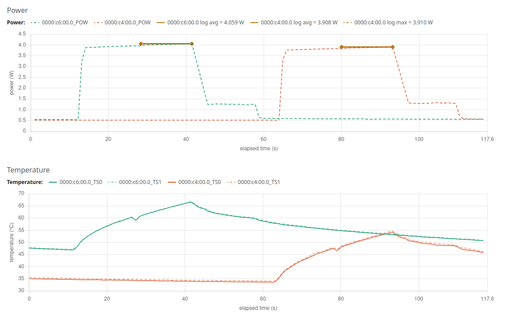

# mb-powermon

Power and temperature measurement utility for edge AI NPUs.


`mb-powermon` is an [NVTOP](https://github.com/Syllo/nvtop)-style terminal monitor for AI accelerator boards and external power-measurement hardware. It runs anywhere a terminal does — no X server, no GUI — and shows per-device identity, PCIe link state, temperatures, and power as scrolling time-series graphs.

## Supported devices

| Probe       | Hardware                                                                 | Metrics                                              |
| ----------- | ------------------------------------------------------------------------ | ---------------------------------------------------- |
| `hailo`     | Hailo-8 / 8L / 8R PCIe + M.2 modules                                     | `POW`, `TS0`, `TS1` (both on-die temperature sensors); status row `CLOCK <MHz>  THERMAL [ OK \| L1 \| L2 \| L3 \| MAX ]  TEMP_PROT <ON\|OFF>  OCP [ OK \| ALERT]  OCP_PROT <ON\|OFF>` surfaces the firmware's throttling state from `_get_health_information()` (CLOCK = current effective NN clock; THERMAL = 5-tier throttle level in a bracketed badge; OCP = overcurrent zone, binary per the SDK enum; TEMP_PROT / OCP_PROT = feature-enable bits rendered as plain white inline text — `ON` is the safe state, the rare `OFF` reading still pops as the only non-`ON` token in the row) |
| `axelera`   | Axelera Metis M.2                                                        | `SYS` (module/system PVT) + `AI0`–`AI3` (per-AIPU-core PVT) via `triton_trace`; status row `CLOCK <MHz>` from `axr.Context().read_device_configuration()["clock_profile"]`; power not exposed on M.2 |
| `deepx`     | DeepX M1 M.2 (PCI vendor `0x1ff4`)                                       | `T0`/`T1`/`T2` (per-NPU temperature) via `dxrt-cli -s`; status row `CLOCK <MHz>` parsed from the same dxrt-cli line (all 3 NPUs report identical clock); power not exposed on M1 |
| `memryx`    | MemryX MX3 M.2 (MX3-2280-M-4 = 4-chip, MX3-2280-M-2 = 2-chip)            | `T0`…`T(N-1)` (per-MPU temperature) via Linux hwmon (`name="memx0"`) + `POW` (chip power) via `memryx.mxa.get_power()` when the MX3 SDK is installed; status row `CLOCK <MHz>  THERMAL [ OK  OK  OK  OK ]  POWER [ OK ]` surfaces the current clock frequency, **per-chip** thermal-throttle latches (parsed from `/sys/memx0/temperature`), and the module-level power-alert (`[ OK ]` green, `[ALERT]` red) |
| `elmorlabs` | ElmorLabs PMD2 (USB CDC, VID:PID `0483:5740`)                            | `PCIE1/2/3`, `TOTAL`; 10 rails dumped in `--once`    |
| `adafruit`  | Up to 4× Adafruit INA228 power monitors on an Adafruit FT232H USB→I²C bridge (`0403:6014`) | One `P<n>` trace per detected sensor; auto-classifies rail voltage (`P1` → `P1(3.3V)`) |

Each panel also displays the device's PCIe link width/speed and ASPM state when applicable.

## Usage

```bash
# Live TUI — q/ESC quit, r reset history, h help
python3 mb-powermon.py

# Single-shot text snapshot
python3 mb-powermon.py --once

# Stream CSV alongside the TUI (line-buffered, safe to `tail -f`)
python3 mb-powermon.py --csv run.csv

# Restrict to specific probes; the order also controls panel order
python3 mb-powermon.py --probe adafruit,hailo

# Limit to a specific device by PCI BDF or serial port path
# (Hailo / Axelera / DeepX / MemryX → PCI BDF; PMD2 → /dev/tty*)
python3 mb-powermon.py --device 0000:c6:00.0

# Tune INA228 calibration (shared across all sensors on the bus)
python3 mb-powermon.py --ina228-shunt 0.015 --ina228-max-current 5

# Print probe-init diagnostics to stderr
python3 mb-powermon.py --verbose
```

`--help` lists every option, including `--interval`, `--time-range`, `--temp-max`, `--power-max`, `--graph-rows`, `--active-only`, and the `--ina228-*` calibration knobs.

## Installation

`mb-powermon` is a single Python 3 script. Vendor SDKs are loaded lazily — install only what you need for the hardware you have.

| Probe       | Requires                                                                 |
| ----------- | ------------------------------------------------------------------------ |
| `hailo`     | [`hailo_platform`](https://hailo.ai/) (HailoRT runtime + Python bindings) |
| `axelera`   | `axelera.runtime` Python package + the `triton_trace` binary (auto-located on `$PATH` or `/opt/axelera/runtime-*/bin`) |
| `deepx`     | The `dxrt-cli` binary (DXRT 3.2.0+, auto-located on `$PATH` or `/usr/local/bin/dxrt-cli`) — telemetry only, no Python SDK needed for the probe |
| `memryx`    | The `memx-drivers` apt package (registers a Linux hwmon node at `/sys/class/hwmon/hwmonN/` with `name="memx0"`) for per-MPU temperatures — no root needed. Optional: the MemryX MX3 SDK (`memryx.mxa`) for chip power, voltage, clock, and thermal/power-alert state. With the SDK absent, the probe still works in temperature-only mode |
| `elmorlabs` | `pyserial`                                                               |
| `adafruit`  | `adafruit-blinka`, `adafruit-circuitpython-ina228`, `pyftdi`             |

If a probe's SDK isn't installed, devices of that type render with an `ERROR` row but the rest of the TUI keeps working.

### ASPM readings

Reading the PCI Express Capability's Link Control register (for the ASPM field) requires access past byte 64 of `/sys/bus/pci/devices/<BDF>/config`, which is gated by the kernel's `CAP_SYS_ADMIN` capability — unprivileged readers get a 64-byte truncation. Without escalation the field shows `<needs root or sudo -n>`.

The probe transparently retries via `sudo -n cat <config>`, so the **recommended fix is a narrow sudoers entry** that grants passwordless read access to PCI config space and nothing else:

```sh
# /etc/sudoers.d/mb-powermon-aspm   (chmod 0440, edit via `sudo visudo -f ...`)
abbeefai ALL=(root) NOPASSWD: /usr/bin/cat /sys/bus/pci/devices/*/config
```

Replace `abbeefai` with your username. After installing the file, `mb-powermon.py` (run as your normal user) will show `ASPM L0s L1` instead of the truncation placeholder.

**Don't run the whole tool under `sudo`.** Vendor SDKs (Hailo, MemryX, Axelera, Adafruit FT232H) live in your user venv; `sudo python3 mb-powermon.py` falls back to the system Python and silently loses every SDK-dependent probe — the INA228 path in particular returns 0 devices because `scan_adafruit_devices()` can't import `adafruit_ina228`. If you absolutely need to run as root (e.g. for a one-off test), invoke the venv's interpreter explicitly: `sudo /path/to/venv/bin/python3 mb-powermon.py`.

### FT232H + INA228

The Adafruit probe sets `BLINKA_FT232H=1` so Blinka uses the FT232H USB→I²C backend. By default it scans the four canonical INA228 addresses `{0x40, 0x41, 0x44, 0x45}` and instantiates one sensor per responding address. Override with `--ina228-addresses`.

If `pyftdi` enumeration fails with `no langid (permission issue, no string descriptors)`, the `/dev/bus/usb/...` node for **any** FTDI device on the bus has restrictive permissions — pyftdi walks every `0403:*` device during scan and trips on the first one it can't read. Run the bundled helper to install a vendor-wide udev rule that covers all current and future FTDI peripherals:

```bash
./fix-ftdi-permissions.sh
```

The rule is `SUBSYSTEM=="usb", ATTRS{idVendor}=="0403", MODE="0666"`, which is broader than just the FT232H (`0403:6014`) — it also covers FT2232H/FT4232H breakouts and the FT4232HL on AMD ZCU104 boards. Script is idempotent and safe to re-run; udev applies new modes on `add` events, so a stubborn device may need an unplug-replug cycle.

## Output

Each device renders as a panel with:

1. **Identity line** — `Device N [BDF Board ARCH]  PCIe x4/x4 @ 8.0GT/s  ASPM L1`
2. **Stats line** — product name, description, part number, serial (or `ERROR` + reason)
3. **Status line** (NPU probes only) — `<LABEL> value  <FLAG> [ OK ]  ...`. All four NPU probes show a `CLOCK <MHz>` prefix at minimum; Hailo and MemryX additionally render state-flag badges. Three built-in badge styles, picked per flag by the probe:
   - **Binary OK/ALERT** (default, bracketed) — bold-green ` OK ` for `0`, bold-red `ALERT` for non-zero, dim ` -- ` for no reading. Used for event indicators like Hailo `OCP` and MemryX `POWER`.
   - **Multi-state ladder** (bracketed) — custom formatter the probe supplies. Hailo's `THERMAL` shows a 5-state ladder ` OK ` / ` L1 ` / ` L2 ` / ` L3 ` / ` MAX` (green / yellow / magenta / red / red+reverse) matching the firmware's 4 graduated throttle tiers plus the "not throttling" baseline.
   - **Plain white ON/OFF** (`_on_off_white_badge`, bracketless) — plain-white `ON ` for `1`, plain-white `OFF` for `0` — no brackets, no bold, low-key inline text. Used for protection-enabled bits like Hailo's `TEMP_PROT` and `OCP_PROT`. At idle they nearly always read `ON`; the rare `OFF` transition (someone explicitly disabled protection) still pops in the row because it's the only non-`ON` token.
   Consecutive `PREFIX_<digit>` flags collapse into one widget (e.g. MemryX's `THERMAL_0..THERMAL_3` → `THERMAL [ OK  OK  OK  OK ]`), one inner badge per chip. All four NPU probes (Hailo, MemryX, Axelera, DeepX) populate this row with at least a `CLOCK <MHz>` prefix; Hailo + MemryX add badges on top. PMD2 and INA228 skip it (no row cost).
4. **Inline bars** — one per metric, color-coded
5. **Time-series graph** — one trace per metric; y-axis caps from `--temp-max` / `--power-max` or per-metric overrides

The `--csv` and `--once` outputs include the full per-rail PMD2 snapshot and per-sensor INA228 voltage/current, which the TUI omits to keep panels readable. State-flag values become extra integer columns in the CSV — MemryX adds `<bdf>_THERMAL_0..3` (per-chip throttle) and `<bdf>_POWER` (module power-alert); Hailo adds `<bdf>_THERMAL` (−1 / 0 / 1 / 2 / 3 — throttling level), `<bdf>_TEMP_PROT` and `<bdf>_OCP_PROT` (0 / 1 — protection-enabled bits, normally `1`), and `<bdf>_OCP` (0 / 1 — overcurrent zone). Axelera and DeepX add no state-flag columns — neither firmware exposes a host-readable throttling-state API. The CLOCK prefix is always display-only, never logged to CSV (Hailo's CLOCK is derivable from `<bdf>_THERMAL` plus the firmware's static per-level table; Axelera/DeepX/MemryX CLOCKs are operating-point info, not load-varying metrics).

`--once` field labels render uppercase (`BOARD`, `PRODUCT`, `PCIE`, `ASPM`, `POW`, `TS0`, `CLOCK`, `THERMAL`, `OCP_PROT`, `RAIL ATX12V`, …) — same across all probes so output is greppable. MemryX's SDK clock is rendered as `CLOCK = X MHz` to match Hailo, not `FREQ`.

Example Hailo `--once` panel:

```
[0000:c5:00.0]
    BOARD     = Hailo-8  ARCH=HAILO8
    PRODUCT   = HAILO-8 AI ACC M.2 M KEY MODULE EXT TEMP
    PART      = HM218B1C2FAE
    SERIAL    = HLLWM2B225101659
    PCIE      = x4/x4 @ 8.0 GT/s PCIe (max 8.0 GT/s PCIe)
    ASPM      = L1
    POW       = 1.95W
    TS0       = 34.64°C
    TS1       = 34.58°C
    CLOCK     = 400MHz
    THERMAL   = -1 (OK)
    TEMP_PROT = 1 (ON)
    OCP       = 0 (OK)
    OCP_PROT  = 1 (ON)
```

### Troubleshooting: INA228 reads exactly `0.0` W during heavy load

If your CSV / TUI shows an INA228 sensor reporting **exactly `0.000000` W** during a workload that's clearly drawing power (e.g. temperature climbs while power flat-lines at zero), it means the actual current has briefly exceeded `--ina228-max-current` and the INA228's current-overflow flag has latched. The chip's `power` register reports 0 W until the flag clears.

**Fix:** re-run with a higher `--ina228-max-current`. The default 5 A is sized for Hailo-8 (~1.5 A peak) and Axelera Metis M.2 (~4.5 A peak), but **MemryX MX3 in 20T boost mode** routinely exceeds it during transient inrush at ramp-up (steady-state is ~4 A, transients can hit 8-12 A).

```bash
# Comfortable margin for MX3 20T mode
python3 mb-powermon.py --ina228-max-current 10 --csv run.csv
```

The 0.015 Ω shunt's hard ceiling is ~10.9 A (the chip's ±163.84 mV input range / 0.015 Ω). To measure beyond that you'd need a smaller shunt.

## Plotting CSV runs



`csv-to-html-plot.py` turns an mb-powermon CSV into a self-contained HTML file with two [Chart.js](https://www.chartjs.org/) plots — power and temperature, one trace per `<device>_POW / _TEMP / _TS0 / _TS1` column. The output works offline (Chart.js loads from a CDN; cache the page once and it renders without network access).

```bash
# Default: writes <input>.html next to the CSV
python3 csv-to-html-plot.py -i run.csv

# Overlay hailortcli benchmark avg/max markers from a captured log
python3 csv-to-html-plot.py -i run.csv -l benchmark.log -o run.html

# Disable auto downsampling (1 = every sample plotted)
python3 csv-to-html-plot.py -i run.csv -d 1
```

For long captures the script applies min-max bucket downsampling (preserving peaks and troughs) so the HTML stays a manageable size while still showing transients. With `-l`, it parses `Device <BDF>: Power in streaming mode (average/max)` blocks from a `hailortcli benchmark` log and overlays each as a horizontal marker on the matching device's active phase.

## Acknowledgements

Inspired by [NVTOP](https://github.com/Syllo/nvtop). 
PMD2 support from [ElmorLabs/PMD2-Python](https://github.com/ElmorLabs/PMD2-Python).

## License

Apache License 2.0. See [LICENSE](LICENSE).
